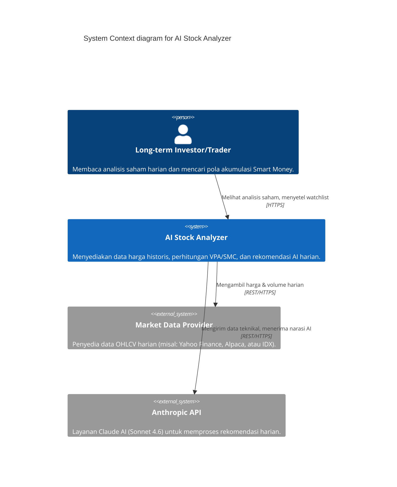
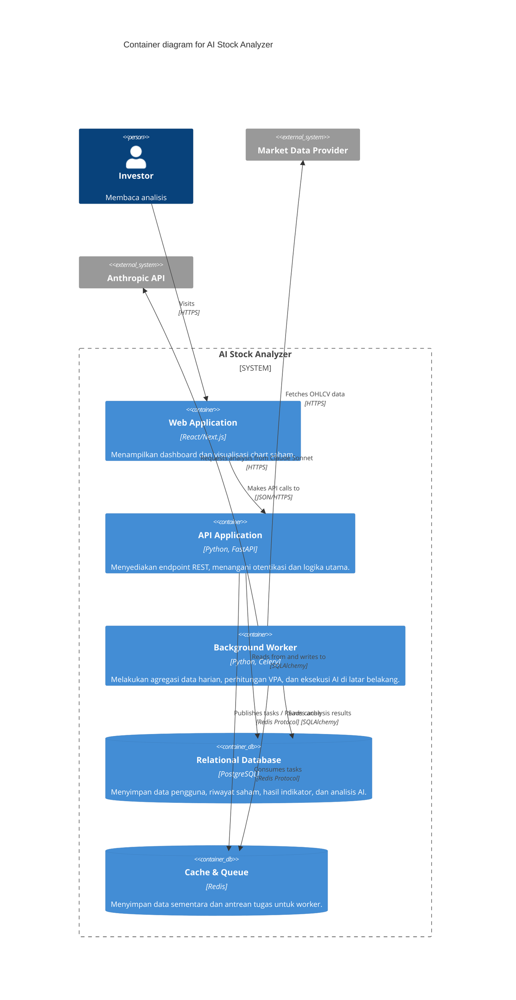
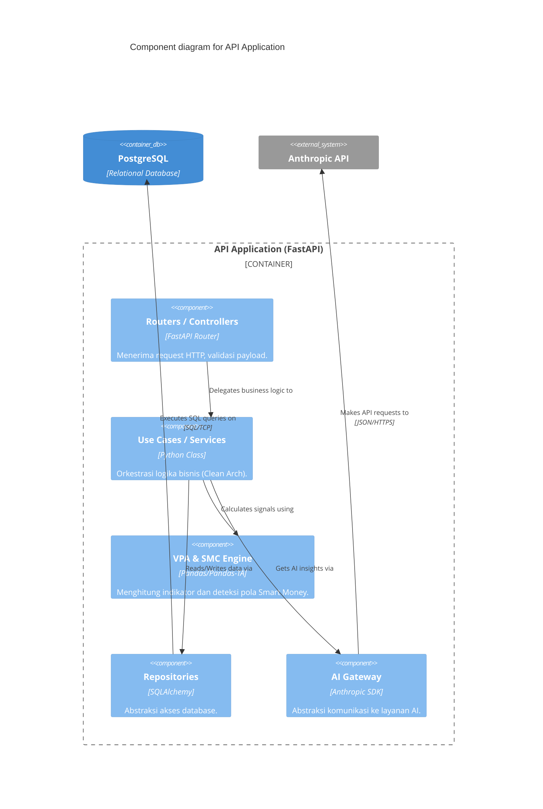

# Software Architecture & C4 Model

## 1. Architectural Pattern: Clean Architecture
Aplikasi ini akan dibangun menggunakan **Clean Architecture** (juga dikenal sebagai Hexagonal Architecture/Ports and Adapters) menggunakan framework **FastAPI (Python)**. 

Tujuan utamanya adalah mengisolasi logika bisnis analisis saham (VPA, Wyckoff, Smart Money Concepts) dari elemen eksternal seperti database dan penyedia layanan AI.

### Struktur Layer:
- **Domain Layer**: Berisi entitas inti bisnis (`Stock`, `PriceData`, `User`, `AnalysisResult`).
- **Use Case Layer**: Berisi logika aplikasi (`FetchDailyPrices`, `CalculateIndicators`, `DetectWyckoffPhase`, `GenerateAIRecommendation`).
- **Interface Adapters Layer**: FastAPI Controllers (Router), Repositories Interfaces.
- **Infrastructure Layer**: Implementasi SQLAlchemy untuk PostgreSQL, Celery/Redis untuk background queue, HTTP Client untuk external market data, dan Anthropic SDK untuk Claude AI.

## 2. AI Integration Strategy (Cost Optimization)
Sesuai arahan workflow referensi, kita menggunakan **Two-Tier AI Approach**:
1. **Strategic (Opus 4.6)**: Digunakan di luar aplikasi (atau via admin panel) untuk menyusun *System Prompt* terbaik, mendesain kriteria teknikal, dan mengevaluasi performa prompt.
2. **Operational (Sonnet 4.6)**: *Background worker* (Celery) akan berjalan setiap tutup pasar (End of Day). Worker ini akan mengumpulkan data harga, volume, hasil VPA (diolah oleh algoritma Python biasa non-AI), dan pola SMC. Data ini kemudian diinjeksikan ke *System Prompt* dan dikirim ke **Sonnet 4.6** untuk menghasilkan narasi analisis yang dibaca pengguna. Ini menghemat penggunaan token Opus yang mahal.

## 3. C4 Model Diagrams

### Level 1: System Context Diagram
Diagram ini menunjukkan interaksi sistem aplikasi dengan aktor eksternal.

### Level 2: Container Diagram
Menunjukkan arsitektur internal dari sistem.

### Level 3: Component Diagram (API Application)
Memperlihatkan komponen internal di dalam backend FastAPI sesuai Clean Architecture.

