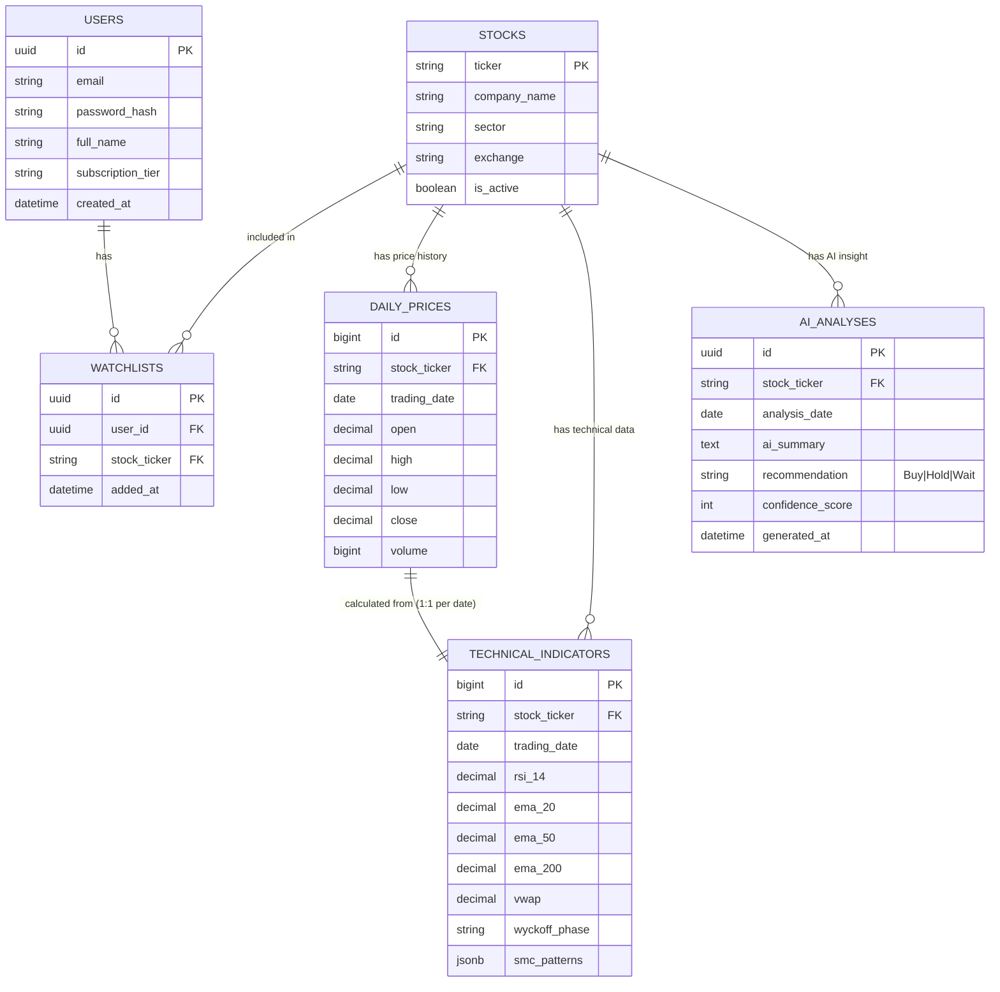

# Database Design & ERD

## 1. Database Selection: PostgreSQL
PostgreSQL dipilih karena:
1. Sangat andal dalam menangani data relasional yang kompleks.
2. Mendukung **Table Partitioning** yang sangat vital untuk menyimpan data time-series (seperti harga saham harian) yang jumlahnya akan terus membengkak seiring waktu.
3. Mendukung fitur JSONB jika kita perlu menyimpan data konfigurasi indikator yang fleksibel.

## 2. Entity Relationship Diagram (ERD)

## 3. Database Optimizations
1. **Partitioning**: Tabel `DAILY_PRICES` dan `TECHNICAL_INDICATORS` akan dipartisi secara bulanan atau tahunan (`PARTITION BY RANGE (trading_date)`) untuk memastikan query pengambilan chart harga berjalan dengan cepat meskipun data mencapai puluhan juta baris.
2. **Indexing**: 
   - Composite index pada `(stock_ticker, trading_date DESC)` di tabel `DAILY_PRICES` dan `TECHNICAL_INDICATORS` karena API akan sering meminta "data 100 hari terakhir untuk saham X".
   - B-Tree index pada kolom pencarian teks (`company_name`, `ticker`).
3. **Caching Layer**: Tabel `AI_ANALYSES` bersifat statis setelah di-generate (EOD). Data ini akan disinkronkan ke Redis agar pemanggilan dari ratusan user tidak membebani database utama.
